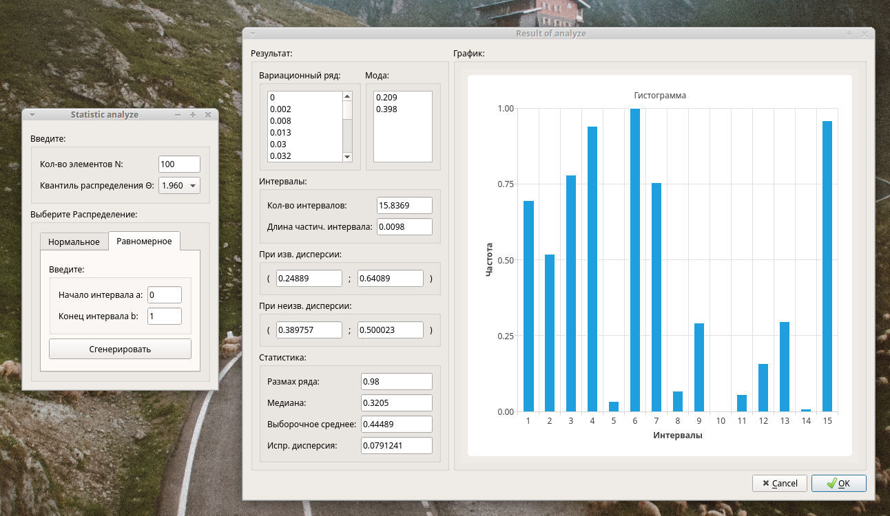

# exp-stat
Processing of experimental computer data. Qt5 program.


***

<h2> Requirements: </h2>

```
Qt5 with QtCharts
```

<h2> Running: </h2>

```
git clone https://github.com/vadrx/exp-stat
cd exp-stat
qtcreator exp-stat.pro
```
Build project and run it.
